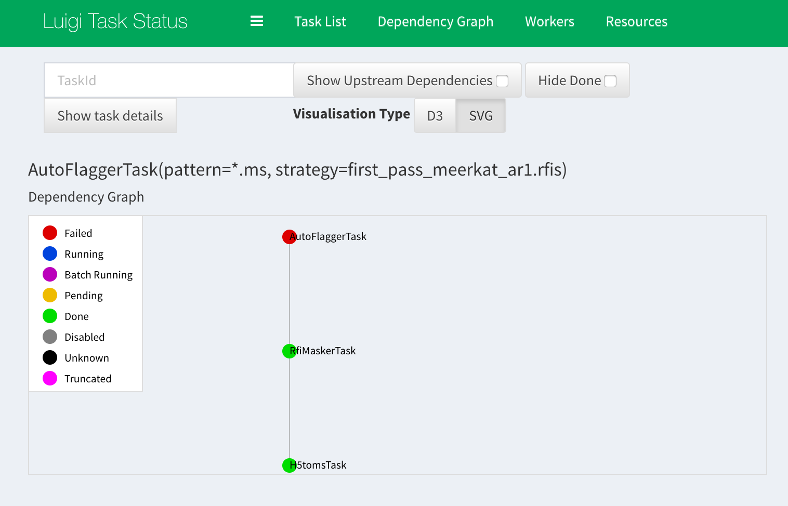

===================
chaining containers
===================

Kliko becomes more interesting in a multicontainer context. It is possible
to chain the output of a container to the input of a next container. There
are multiple ways to accomplish this.

The manual bash way
===================

you can manually set the input and output folders of the kliko containers
and call each consequtive step manually::

    kliko-run kliko/simms --output simms  --tel meerkat
    kliko-run kliko/meqtree-pipeliner --output meqtree-pipeliner --input simms
    kliko-run kliko/wsclean --output wsclean --input meqtree-pipeliner

Using Luigi
===========

Since Kliko 0.8 also has support for Luigi. Luigi is a Python  package that helps you
build complex pipelines of batch jobs. It handles dependency resolution,
workflow management, visualization, handling failures, command line integration, and much more.

Combinig Luigi and Kliko is quite simple, you need to define a ``KlikoTask`` and
override the ``image_name`` method to define the Kliko Image name. You can then define
the Task dependencies using the ``requires()`` method. Here is an example::

    from kliko.luigi_util import KlikoTask

    class DownloadTask(KlikoTask):
        @classmethod
        def image_name(cls):
            return "vermeerkat/downobs:0.1"

    class H5tomsTask(KlikoTask):
        @classmethod
        def image_name(cls):
            return "vermeerkat/h5toms:0.1"

        def requires(self):
            return DownloadTask(url='http://somewhere/somefile.h5', filename='1471892026.h5')

    class RfiMaskerTask(KlikoTask):
        @classmethod
        def image_name(cls):
            return "vermeerkat/rfimasker:0.1"

        def requires(self):
            return H5tomsTask()

    class AutoFlaggerTask(KlikoTask):
        @classmethod
        def image_name(cls):
            return "vermeerkat/autoflagger:0.1"

        def requires(self):
            return RfiMaskerTask(mask='rfi_mask.pickle')

    class WscleanTask(KlikoTask):
        @classmethod
        def image_name(cls):
            return "vermeerkat/wsclean:0.1"

        def requires(self):
            return AutoFlaggerTask()

Which would look something like this in the Luigi web interface:

Simple kliko chaining
=====================

If you don't want to use Luigi we also implemented simple container chaining
with intermediate result caching in kliko. This will create a subfolder
``.kliko`` in your current working directory, containing subdirectories of the
sha256 hash of the image. Each image hash folder will contain one or more
subfolders which are named after the hash created from them specified parameters.
If a Kliko chain is ran and the hash folders already exist the container is not ran
but the results are passed to the next step in the chain.

Example::

    from kliko.chaining import run_chain
    import docker

    docker_client = docker.Client()

    run_chain(
        (
            ('kliko/simms',  {'tel': 'meerkat'}),
            ('kliko/meqtree-pipeliner', {}),
            ('kliko/wsclean', {'weight': 'uniform'}),
        ),
        docker_client
    )

