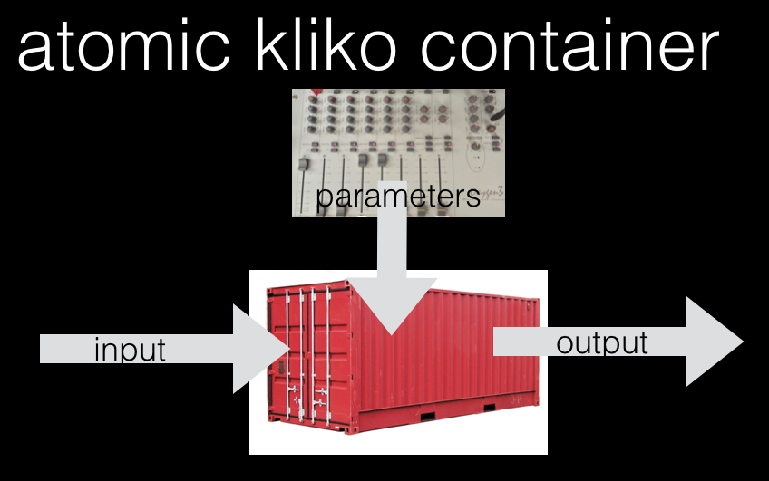

============
Introduction
============

KLIKO is a specification, validator and parser for the Scientific Compute Container specification. KLIKO is written in
Python.

This documentation is intended for the developer who wants to package up a piece of software into a Kliko container.

installation
============

Development of Kliko is done on `github <https://github.com/gijzelaerr/kliko>`_. You can install Kliko inside a docker
container or just on your system::

    $ python setup.py install

or from pypi::

    $ pip install kliko

Why Kliko?
==========

Kliko was born out of our needs to have a more formal and uniform way of scheduling batch compute tasks on arbitrary
public and private cloud platforms. Docker is perfect for encapsulating and distributing software, but the input
output flow is not defined. Kliko is an attempt to create a standard way to define compute input, output and parameters.

Kliko assumes your problem looks like this:

Kliko containers can be chained up in a sequence, for example using `NextFlow <http://www.nextflow.io/>`_. An other
use case is to simplify the parameterized scheduling of compute tasks using
`RODRIGUES <https://github.com/ska-sa/rodrigues/>`_.

Getting started
===============

Creating a Kliko container
--------------------------

 * Create a Docker container from your application
 * Create a script ``/kliko`` in the container that can parse and use a ``/parameters.json`` file.
 * Add a ``kliko.yml`` file to the root of the container which defines the valid fields in the parameters file.
 * You can validate your kliko file with the ``kliko-validate`` script installed by the kliko Python library.

Running a kliko container
-------------------------

You can run a kliko container in various ways. The most simple way is to use the ``kliko-run`` script which is
installed on your system when you install Kliko. Use ``kliko-run <image-name> --help`` to see a list of accepted
parameters.

If you already have a parameters file you can also run the container manually::

    $ docker run -v parameters.json:/parameters.join:ro -v input:/input:ro -v output:/output:rw <image-name> kliko

Finally you can also run kliko images and visualise results using `RODRIGUES`_,
a web based kliko runner.

Contributing
============

Contributions are more than welcome! If you experience any problems let us know in the bug tracker. We accept patches
in the form of github pull requests. Please make sure your code works with python 2 and python3, and is pep8 compatible.
Also make sure the test suit actually passes all tests. We use docker in some of the tests so you need to have that
installed and configured.

Testing
=======

Note that before you run the test suite you have to create a ``klikotest`` docker image by running ``make`` in
the ``examples`` folder.
