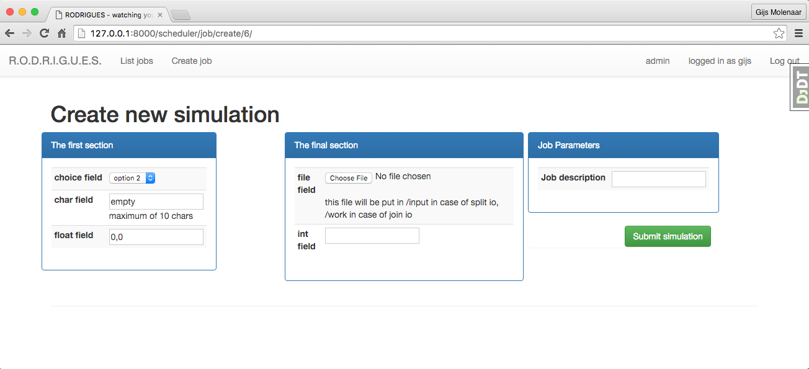

=================
The specification
=================

 * Kliko is based on standard docker containers
 * Container mush have a CMD specified, which would be the main program of the container. It should not require
   arguments.
 * logging should be written to STDOUT and STDERR.
 * We define two types of compute containers, split IO and joined IO containers.
 * For split IO Input files will be mounted read only into ``/input``. Output file should be written to ``/output``,
   which will be mounted by the host.
 * For joined IO containers input & output is the /work folder which will be mounted RW.
 * parameters for the computation will be given when the container is run in the form of a file in json format called
   ``parameters.json`` in ``/input``
 * Which parameters the container will accept should be defined in a yaml file ``/kliko.yml``
 * The ``kliko.yml`` file should follow the schema defined in ``kliko/schema.yml``.
 * an example parameters definition file can be found in ``examples/form.yml``
 * fields with type file will enable supply of custom input files. these will be put in the ``/input`` folder.

The kliko.yml file
==================

The kliko file should be in YAML format and has these required fields:

schema_version
--------------

The version of the kliko specification. note that this is independent of the versioning of the Kliko library.

name
----

Name of the kliko image. For example ``radioastro/simulator``.

description
-----------

A more detailed description of the image.

author
------

Who made the container.

email
-----

email adres of the author.

url
---

Where to find the specific kliko project on the web.

io
--

Which IO mode to use, could be ``join`` or ``split``. For split IO Input files will be mounted read only into
``/input``. Output file should be written to ``/output``, which will be mounted by the host.  For joined IO containers
input & output is the /work folder which will be mounted RW.

Sections
--------

The paramaters are grouped in sections. Sections are just lists of fields.

fields
------

A section consists of a list of fields.

field
-----

each field has 2 obligatory keys, a ``name`` and a ``type``. Name is a short reference to the field which needs to be
unique. This will be the name for internal reference. The type defines the ``type`` of the field and can be one of
``choice``, ``char``, ``float``, ``file``, ``bool`` or ``int``.

Optional keys are:
 * **initial**: supply a initial (default) value for a field
 * **max_length**: define a maximum length in case of string type
 * **choices**: define a list of choices in case of a choice field. The choices should be a mapping
 * **label**: The label used for representing the field to the end user. If no label is given the name of the field
              is used.
 * **required**: Indicates if the field is required or optional
 * **help_text**: An optional help text that is presented to the end user next to the field.

An example kliko.yml file
=========================

Below is an example kliko file.

.. literalinclude:: ../examples/kliko.yml
   :language: yaml
   :linenos:

Loading a Kliko container with the previous kliko file is loaded up in RODRIGUES will result in the form below:

Processing this form will result in the following parameters.json file which is presented to the Kliko container
on runtime:

.. literalinclude:: ../examples/parameters.json
   :language: json
   :linenos: